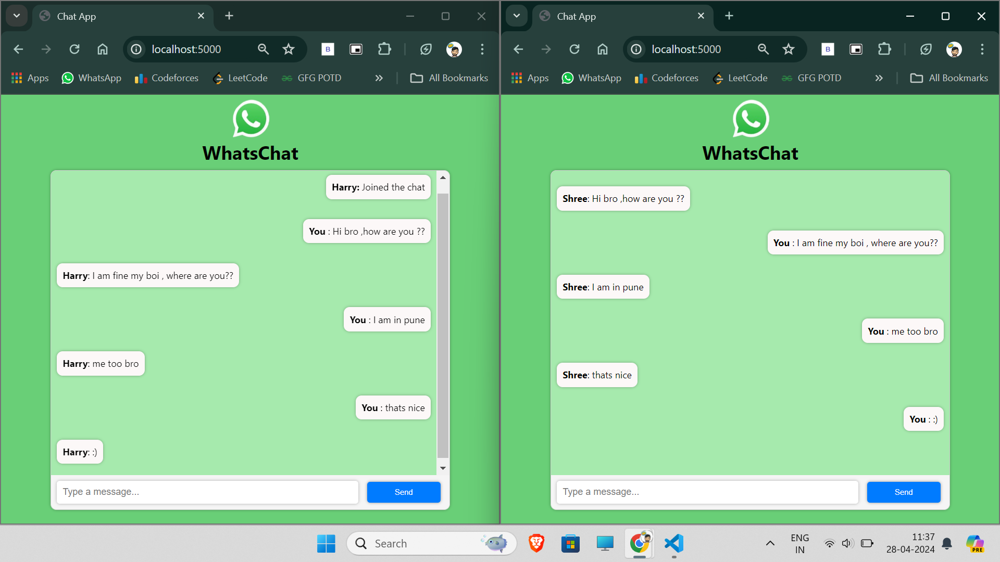

# WhatsChat - Real-time Chat Application

WhatsChat is a real-time chat application built using Node.js, Express.js, and Socket.IO. It allows users to join chat room, send messages, and receive instant updates when other users join or leave the chat.

## Features

- Real-time messaging: Instantly send and receive messages within the chat room.
- User notifications: Get notified when a new user joins or leaves the chat.
- Simple interface: Clean and intuitive user interface for seamless chatting experience.

## Screenshots



## Setup Instructions

1. Clone the repository:

```bash
git clone https://github.com/shrinivask007/WhatsApp-Clone
```

2. to the project directory:
```bash
cd WhatsApp-Clone
```
3. Install dependencies:
```bash
npm install
```
4. Start the server:
```bash
node server.js
```
Open your web browser and go to http://localhost:5000 to access the chat application.
## Dependencies
1. Express.js: Web framework for Node.js
2. Socket.IO: Real-time bidirectional event-based communication library
## Contributing
Contributions are welcome! Please feel free to submit issues or pull requests.

## Code of Conduct

Please review our [Code of Conduct](CODE_OF_CONDUCT.md) before contributing to this project.

## License

This project is licensed under the MIT License. See the [LICENSE](LICENSE) file for details.

